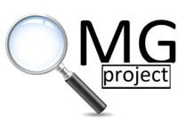

```{r, echo=FALSE, out.width="30%", fig.align = 'center'}

```


The **OMG** project stands for "**O**verviews: **M**ethodology and **G**uidance".

This website presents the first Database that contains a large number of healthcare overviews of reviews published in English. 
The database provides a comprehensive source that can be freely used by all researchers to easily identify overviews of reviews on a specific topic, to avoid duplication of effort and reduce research waste. 

The tab named Databases includes:

1. Overviews Database, a list of overviews of interventions, associations, DTA, etc.

2. Methodologiacal Overviews Database, a list of methodological overviews that are used to evaluate reliability, transparency, and reporting of reviews.

3. Guidances Database, a list of methodological papers relevant to overviews are included in the tab named "Guidance Database".

The databases will be regularly updated with new data and studies.


Last update `r format(Sys.Date(), "%d\\/%m\\/%Y")`


